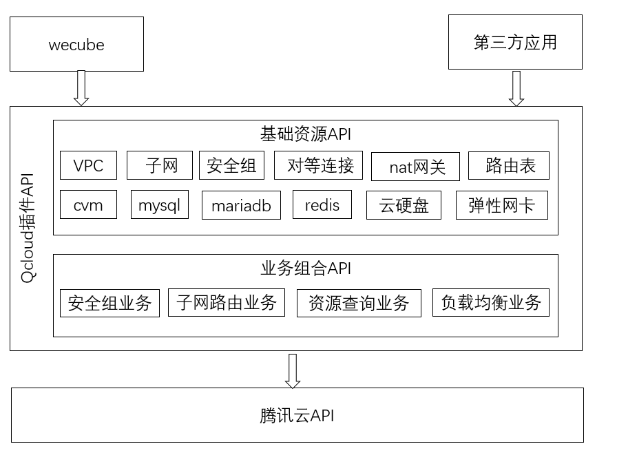

# QCLOUD插件
[](https://opensource.org/licenses/Apache-2.0)


## 简介

QCloud插件对腾讯云原生资源(如CVM、CLB、NAT网关、安全组等)的生命周期管理接口进行业务封装，提供更贴近业务使用场景的API接口，这些API可以分为两类：
1. 基础资源API，对原生的qcloud插件入参进行简化，如CVM的创建接口原生腾讯云API有很多参数需要输入，如操作系统，机型、安全组等，这些参数都是id类型的值，用户需要查看大量的文档才能确定这些id值。qcloud插件API可将这些参数的细节对用户隐藏起来，用户只需填入操作系统版本如(centos7.2)，机器对应的硬件配置(如2核4G),即可通过qcloud插件的API在腾讯云上创建出对应的cvm。

2. 业务组合API提,供基于腾讯云原生api的业务组合api，如创建子网时，默认会创建对应该子网的路由表；根据ip查询ip对应的资源类型和所在地域；根据输入的源IP，目标ip，开发端口和协议，自动创建对应的安全组入栈和出栈规则并绑定安全组到对应的资源上等

## 使用qcloud插件的场景
qcloud插件API包含的功能如下图所示,使用qcloud插件主要有两种场景:
1. 通过wecube注册插件来使用插件的功能
2. 独立部署使用，这种场景第三方应用使用http请求向插件发起请求。




## qcloud编译和插件包的制作
[QCloud插件编译文档](docs/compile/wecube-plugins-qcloud_compile_guide.md)


## qcloud插件包独立运行
qcloud插件包编译为docker镜像后，执行如下命令运行插件

```
docker run -d  -p 9081:9081  --restart=unless-stopped -v /etc/localtime:/etc/localtime -v /home/app/wecube-plugins-qcloud/logs:/home/app/wecube-plugins-qcloud/logs   wecube-plugins-qcloud:v10
```

## API说明
关于QCloud插件的API说明，请查看以下文档
[QCloud插件API手册](docs/api/wecube_plugins_qcloud_api_guide.md)

## License
QCloud插件是基于 Apache License 2.0 协议， 详情请参考
[LICENSE](LICENSE)

## 社区
- 如果您想得到最快的响应，请给我们提issue。
- 联系我们：fintech@webank.com