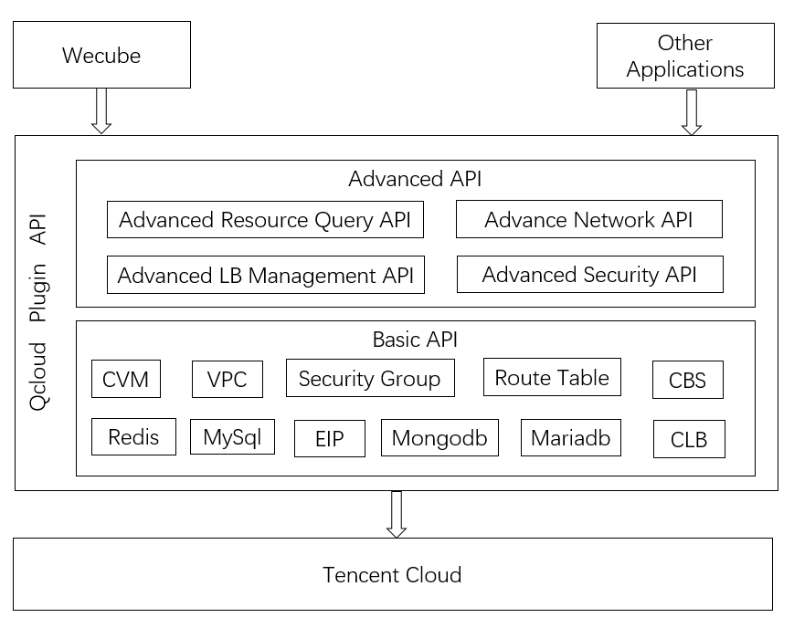
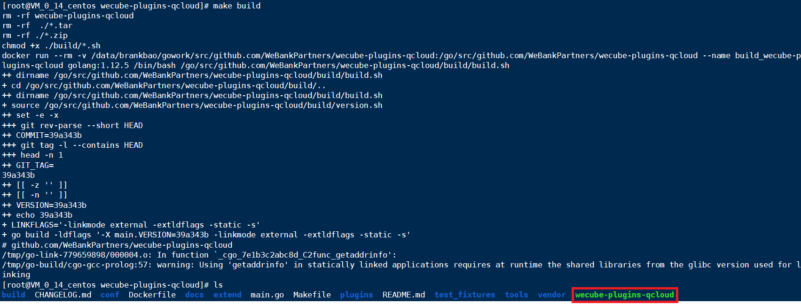
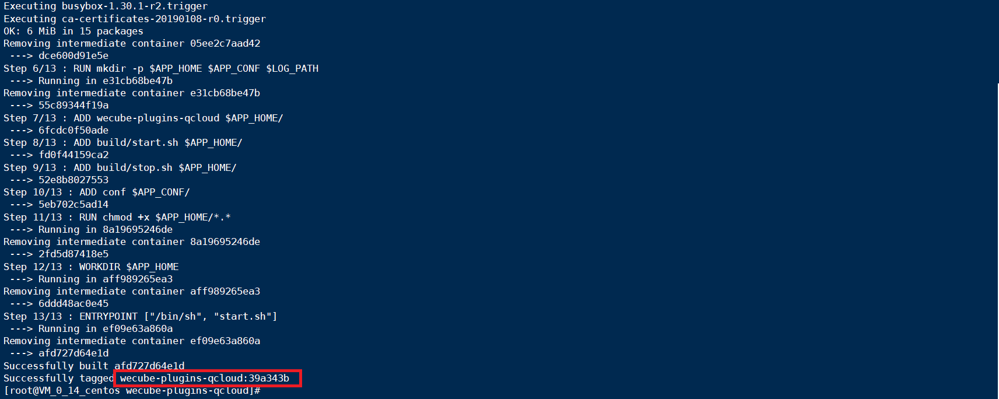
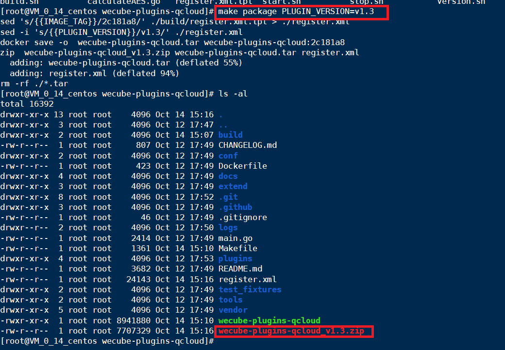

# Wecube QCloud Plugin
[](https://opensource.org/licenses/Apache-2.0)


[中文](README.md) / English

## Introduction

QCloud plugin is an open-source project used by Wecube to management life cycle of IAAS and PAAS resource on Tencent Cloud.

It provides basic resource manangement and some advanced apis to support more complicated context,like create subnet with route table,query resource type and region with ip address,create loadbalancer and associate backend host with no need to care CLB(tencent cloud loadbalancer) listener,etc.




## Build and Run Docker Image

Before execute following command,please make sure docker command is installed on a centos host.[How to Install Docker](https://docs.docker.com/install/linux/docker-ce/centos/)

1. Git clone source code 
```
git clone https://github.com/WeBankPartners/wecube-plugins-qcloud.git
```

2. Build plugin binary
```
make build 
```


3. Build plugin docker image,the docker image tag is github's commit number.
```
make image
```


4. Run plugin container,please replace variable IMAGE_TAG with your image tag
```
docker run -d -p 8081:8081 --restart=unless-stopped -v /etc/localtime:/etc/localtime  wecube-plugins-qcloud:{$IMAGE_TAG}
```

5. On same host,use curl command to check if QCloud plugin works fine.Please replace variable your_SecretID and your_SecretKey with your Tencent Cloud Account's SecretID and SecretKey.If you see a vpc with CIDR 10.5.0.0/16 is created on Tencent Cloud,the plugin is work fine.
```
curl -X POST http://127.0.0.1:8081/v1/qcloud/vpc/create -H "cache-control: no-cache" -H "content-type: application/json" -d "{\"inputs\":[{\"provider_params\": \"Region=ap-shanghai;AvailableZone=ap-shanghai-1;SecretID={$your_SecretID};SecretKey={$your_SecretKey}\",\"name\": \"api_test_vpc\",\"cidr_block\": \"10.5.0.0/16\"}]}"
```

## Build Plugin Package for Wecube

If you want to build a Plugin Package to work with Wecube,please execute following command .You can replace variable package_version with version you want.
```
make package PLUGIN_VERSION=v{$package_version}
```



