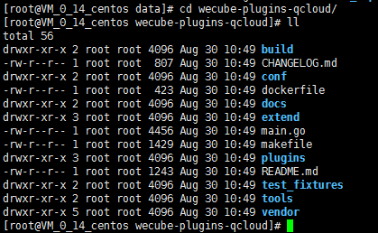
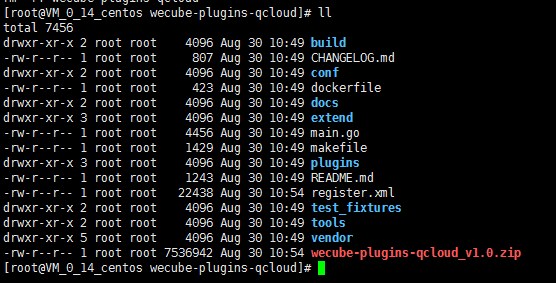

# WeCube Plugins QCLOUD Compile Guide

## Before compilation
1. One Linux host with the Internet connection, we recommend a host with 4+ cores CPU and 8+ GB RAM.
2. Ubuntu 16.04+ or CentOS 7.3+
3. Install Git
	- yum install
	```shell script
 	yum install -y git
 	```
	- PLease refer to [git install guide](https://github.com/WeBankPartners/we-cmdb/blob/master/cmdb-wiki/docs/install/git_install_guide_en.md) on how to install manually.

4. Install Docker 1.17.03.x or higher
	- PLease refer to [Docker install guide](https://github.com/WeBankPartners/we-cmdb/blob/master/cmdb-wiki/docs/install/docker_install_guide_en.md) on how to install Docker.


## Compiling and Packaging

1. Clone source code from github
	
	Switch to the local repository directory and execute the command as following
	
	```shell script
	cd /data
	git clone https://github.com/WeBankPartners/wecube-plugins-qcloud.git
	```

	Enter the Github account username and password as prompted, and you can pull the source code to the local.

    After that, enter the `wecube-plugins-qcloud` directory and the structure is as follows:

	

2. Compile and package the plugin

	Build plugin binary
	
	```shell
	make build
	```
	
	


	Build plugin docker image, the docker image tag is Github's commit number
	```shell
	make image
	```

	

	
	If you want to build a plugin package to work with WeCube, please execute the following command. You can replace variable `{$package_version}` with the version number you want.

	```shell
	make package PLUGIN_VERSION=v1.0
	```

	as follows:

	