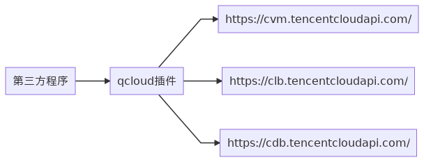

# 腾讯云安全组业务接口
- [部署说明](#deployment) 
- [接口说明](#api) 
- [代码说明](#code)
- [接口局限性](#problems)

## <span id="deployment">部署说明</span>

qcloud插件接口调用关系如下:



qcloud插件部署时，需设置如下环境变量:

|变量名称|必填|说明|
|-----|-----|-----|
|SECRET_ID|是|腾讯云帐号secretId，调用腾讯云API时鉴权使用|
|SECRET_KEY|是|腾讯云帐号secretKey，调用腾讯云API时鉴权使用|
|REGIONS|是|查询资源时搜索哪些地域，多个地域之间用分号分割，如ap-guangzhou;ap-shanghai|
|https_proxy|否|当需要通过https代理才能腾讯云API时，需要设置该环境变量

当有https代理时，需要启动qcloud二进制程序的脚本如下:

```
 env SECRET_ID=xxxx \
     SECRET_KEY=xxx  \
     REGIONS="ap-guangzhou;ap-shanghai" \
     https_proxy="http_proxy_server:http_proxy_server_port" \
     nohup ./wecube-plugins-qcloud >./stdout.txt 2>&1 &
```

停止qcloud二进制程序的脚本如下:

```
pidof wecube-plugins-qcloud | xargs kill -9

```

## <span id="api">接口说明</span>
安全组策略业务api用于在大规模、多地域使用腾讯云资源过程中，快速根据源ip和目标ip等参数自动生成对应的安全组策略并实施，避免用户通过腾讯云控制台对多个地域多个资源进行ip资源查询后进行手动创建安全策略并关联安全组到具体资源实例的操作。

目前提供的组合api有两个：
- 计算安全组策略接口: 根据源ip，目标ip，目标端口，协议，action(drop 或accept)和安全组方向(入栈和出栈)这六元组，返回需要添加的安全组策略。用户可人工确认自动产生的安全组策略是否正确,如果正确可将该输出参数作为第二个实施接口的输入入参来实施对应的安全组。

- 实施安全组策略接口: 根据计算安全组策略接口的出参，调用腾讯云的api创建对应的安全组，并关联到对应的腾讯云资源。


### 计算安全组策略接口

#### 接口url
```
http://server:port/v1/bs-security-group/calc-security-policies
```

#### 输入参数

|参数名称|参数类型|参数说明|
|-------|------|----|
|protocol|string|协议类型 tcp或udp|
|source_ips|string数组|允许访问目标地址的源ip地址|
|dest_ips|string数组|允许源IP访问的目标ip地址|
|dest_port|string|需要放通的端口，如果有多个端口需要开通则用分号分隔|
|policy_action|string|策略是放通还是拒绝，有效值为accept 和drop|
|policy_directions|string数组|策略方向，如只开入栈，或者只开出栈，或者是入和出都开，有效值为ingress和egress|
|description|string|通过接口创建的安全组和安全组策略都会带上该描述字段，可通过该字段和工单系统的编号做关联|

#### 输出参数

|参数名称|参数类型|参数说明|
|-------|------|----|
|result_code|string|0表示接口正常返回，其他值表示接口异常|
|result_message|string|接口异常时的错误详情|
|time_taken|string|调用本次接口的耗时|
|ingress_policies_total|int|生成的入栈策略条数|
|egress_policies_total|int|生成的出栈策略条数|
|ingress_policies|Policy数组|生成的入栈策略|
|egress_policies|Policy数组|生成的出栈策略|


Policy结构如下:

|参数名称|参数类型|参数说明|
|-------|------|----|
|ip|string|需要设置策略的ip|
|type|string|ip对应的资源类型，可以是cvm，clb等|
|id|string|ip对应的资源实例id|
|region|string|ip对应的资源所在地域|
|support_security_group_api|string|ip对应的资源是否支持关联安全组的接口|
|peer_ip|string|需要设置安全组策略的对端ip地址|
|protocol|string|需要设置安全组策略的协议|
|ports|string|需要设置安全组策略的端口|
|action|string|需要设置安全组策略的action|
|description|string|需要设置安全组策略的描述字段|

#### 示例

```
request:
{
    "protocol": "tcp",
    "source_ips": [
        "172.16.0.17"
    ],
    "dest_ips": [
        "172.16.0.2"
    ],
    "dest_port": "80;8081,
    "policy_action": "accept",
    "policy_directions": [
        "egress",
        "ingress"
    ],
    "description": "abc"
}

response:
{
    "result_code": "0",
    "result_message": "success",
    "results": {
        "time_taken": "999.360079ms",
        "ingress_policies_total": 1,
        "egress_policies_total": 1,
        "ingress_policies": [
            {
                "ip": "172.16.0.2",
                "type": "cvm",
                "id": "ins-9v6zys0w",
                "region": "ap-guangzhou",
                "support_security_group_api": true,
                "peer_ip": "172.16.0.17",
                "protocol": "tcp",
                "ports": "80,8081",
                "action": "accept",
                "description": "abc"
            }
        ],
        "egress_policies": [
            {
                "ip": "172.16.0.17",
                "type": "cvm",
                "id": "ins-ekvqwspy",
                "region": "ap-guangzhou",
                "support_security_group_api": true,
                "peer_ip": "172.16.0.2",
                "protocol": "tcp",
                "ports": "80,8081",
                "action": "accept",
                "description": "abc"
            }
        ]
    }
}

```

### 实施安全组策略接口

#### 接口url
```
http://server:port/v1/qcloud/bs-security-group/apply-security-policies
```


#### 输入参数

|参数名称|参数类型|参数说明|
|-------|------|----|
|ingress_policies|Policy数组|需要实施的入栈规则|
|egress_policies|Policy数组|需要实施的出栈规则|

#### 输出参数

|参数名称|参数类型|参数说明|
|-------|------|----|
|policies_total|int|需要实施的入栈或出栈规则有多少条|
|success_policies_total|int|成功实施的入栈或出栈规则有多少条|
|undo_policies_totall|int|未实施的入栈或出栈规则有多少条|
|failed_policies_total|int|实施失败的入栈或出栈规则有多少条|
|success_policies|Polciy数组|成功实施的入栈或出栈规则有哪些|
|undo_policies|Polciy数组|未实施的入栈或出栈规则有哪些|
|failed_policies|Polciy数组|实施失败的入栈或出栈规则有哪些|


#### 示例

```
request:
{
    "ingress_policies": [
        {
            "ip": "172.16.0.2",
            "type": "cvm",
            "id": "ins-9v6zys0w",
            "region": "ap-guangzhou",
            "support_security_group_api": true,
            "peer_ip": "172.16.0.17",
            "protocol": "tcp",
            "ports": "80,8081",
            "action": "accept",
            "description": "abc"
        }
    ],
    "egress_policies": [
        {
            "ip": "172.16.0.17",
            "type": "cvm",
            "id": "ins-ekvqwspy",
            "region": "ap-guangzhou",
            "support_security_group_api": true,
            "peer_ip": "172.16.0.2",
            "protocol": "tcp",
            "ports": "80,8081",
            "action": "accept",
            "description": "abc"
        }
    ]
}

response:
{
    "result_code": "0",
    "result_message": "success",
    "results": {
        "time_taken": "3.805069793s",
        "ingress": {
            "policies_total": 1,
            "success_policies_total": 1,
            "undo_policies_total": 0,
            "failed_policies_total": 0,
            "success_policies": [
                {
                    "ip": "172.16.0.2",
                    "type": "cvm",
                    "id": "ins-9v6zys0w",
                    "region": "ap-guangzhou",
                    "support_security_group_api": true,
                    "peer_ip": "172.16.0.17",
                    "protocol": "tcp",
                    "ports": "80,8081",
                    "action": "accept",
                    "description": "abc"
                }
            ],
            "undo_policies": null,
            "failed_policies": null
        },
        "egress": {
            "policies_total": 1,
            "success_policies_total": 1,
            "undo_policies_total": 0,
            "failed_policies_total": 0,
            "success_policies": [
                {
                    "ip": "172.16.0.17",
                    "type": "cvm",
                    "id": "ins-ekvqwspy",
                    "region": "ap-guangzhou",
                    "support_security_group_api": true,
                    "peer_ip": "172.16.0.2",
                    "protocol": "tcp",
                    "ports": "80,8081",
                    "action": "accept",
                    "description": "abc"
                }
            ],
            "undo_policies": null,
            "failed_policies": null
        }
    }
}
```

## <span id="code">代码说明</span>

安全组相关代码:  https://github.com/WeBankPartners/wecube-plugins-qcloud/tree/master/plugins/bussiness_plugins/security_group

主要的逻辑代码在security_group.go中，其他的文件都以具体的资源名称来命名，如果要支持新的资源类型，只要实现security_group.go中ResourceInstanc和ResourceType定义的接口即可。

#### 主要抽象接口

ResourceType接口:

```
type ResourceType interface {
    QueryInstancesById(providerParams string, instanceIds []string) (map[string]  ResourceInstance, error)
    QueryInstancesByIp(providerParams string, ips []string) (map[string]ResourceInstance, error)
    IsLoadBalanceType() bool
    IsSupportEgressPolicy() bool
}
```

|接口名称|接口说明|
|-----|-----|
|QueryInstancesById|根据资源id查询资源实例|
|QueryInstancesByIp|根据资源ip查询资源实例|
|IsLoadBalanceType|资源类型是否是负载均衡类型|如果是负载均衡类型，和安全组相关的操作都是在LB后端主机上生成|
|IsSupportEgressPolicy|资源是否支持出栈规则设置，像mysql等资源的安全组只支持入栈设置，不支持出栈设置|


ResourceInstance接口:

```
type ResourceInstance interface {
     ResourceTypeName() string
     GetId() string
     GetName() string
     GetRegion() string
     GetIp() string
     QuerySecurityGroups(providerParams string) ([]string, error)
     AssociateSecurityGroups(providerParams string, securityGroups []string) error
     IsSupportSecurityGroupApi() bool
     GetBackendTargets(providerParams string, proto string, port string) ([]ResourceInstance, []string, error)
}
```

|接口名称|接口说明|
|-----|-----|
|ResourceTypeName|实例返回自己所属的资源类型，如clb，cvm等|
|GetId|返回实例对应的资源id|
|GetName|返回实例的别名|
|GetRegion|获取资源实例所在的地域|
|GetIp|获取实例ip地址|
|QuerySecurityGroups|查询实例已经关联哪些安全组|
|AssociateSecurityGroups|关联安全组到实例|
|IsSupportSecurityGroupApi|实例是否支持关联安全组的操作|
|GetBackendTarget|如果设备类型是负载均衡类型，通过该接口获取后端关联的主机信息|

#### 主要流程

##### 计算安全组流程

1. 入参有效性检查。检查端口格式，协议字段，ip格式，action等值是否有效。
2. 根据输入的多个ip并行查询各个地域，获取ip对应的资源实例信息并保存为key-value。
3. 根据入参direction的值确认是否需要生成入栈规则，如果需要就生成入栈规则，并添加到出参的入栈规则中。
4. 根据入参direction的值确认是否需要生成出栈规则，如果需要就生成出栈规则，并添加到出参的出栈规则中。

生成规则的代码在如下函数中,生成入栈规则和出栈规则都是通过该函数生成，入参devIp表示需要生成策略的资源ip，ipMap为根据ip查询腾讯云各个地域后的key-value，peerIps为安全策略对应的对端ip，proto为安全策略的协议，ports为安全策略的端口，direction为设置入栈还是出栈。

```
func calcPolicies(devIp string, ipMap map[string]ResourceInstance, peerIps []string, proto string, ports []string,action string, description string, direction string) ([]SecurityPolicy, error) 
```

该函数的流程如下:
1. 根据devIp在ipMap中找是否能找到ip对应的资源，如果找不到就报错，报错提示为ip找不到
2. 检查direction是否为出栈，如果是出栈检查devIp对应的资源是否支持出栈设置，如果不支持出栈规则设置就报错，报错提示为ip对应的资源类型不支持出栈规则设置
3. 进入for循环，遍历peerIps，根据peerIp检查是否在ipMap中能找到资源类型，如果找到了且资源类型为负载均衡设备并且direction是入栈规则就报错，报错信息为入栈规则不支持对端为负载均衡的设备。
4. 调用newPolicies函数生成安全策略

newPolicies函数的定义如下,其中instance为需设置安全组的资源类型的实例信息,peerIp为对端设备ip。

```
func newPolicies(instance ResourceInstance, peerIp string, proto string, port string, action string, desc string) ([]SecurityPolicy, error) 
```

该函数的流程如下:
1. 检查instance是不是负载均衡设备，如果不是就生成安全策略
2. 如果是负载均衡设备，则根据port和proto查询监听器，如果查不到监听器就报错；如果查询成功，再获取监听器后端的主机，如果没有后端主机就报错
3. 根据负载均衡设备后端的主机信息，生成和后端主机相关的安全策略。


##### 实施安全组流程

1. 入参检查。
2. 调用applyPolicies生成入栈和出栈的安全组并关联到具体的资源实例,其中policies为安全规则，direction为入栈或出栈。

applyPolicies的定义如下:

```
func applyPolicies(policies []SecurityPolicy, direction string) ApplyResult
```

该函数的流程如下:

1. for循环每一条policies
2. 根据当前policy的资源实例id和region查询实例信息，确认实例存在
3. 查询实例关联的安全组信息，然后调用createPolicies函数，生成安全策略并放到对应的安全组中,createPolices函数的定义如下，其中existSecurityGroups为该实例已经关联的安全组，policies为需要新加的策略，返回参数的第一个参数，为本次创建安全组新建了几个安全组。每个自动创建的安全组最多放100条入栈规则和100条出栈规则，当超过100条时，代码会自动创建新的安全组。

```
func createPolicies(providerParams string, existSecurityGroups []string, policies []*SecurityPolicy, direction string) ([]string, error) 
```

4. 根据createPolices返回的新建的安全组，调用实例的关联安全组接口，更新实例关联的安全组。


## <span id="problems">接口局限性</span>

1. 只有添加安全组策略的功能，没有销毁安全组策略的功能
2. 自动添加的安全策略都新建在名称为ip_auoto_xx的安全策略里，当对应ip的主机销毁时，不会自动销毁对应的安全组。
3. 当资源类型是负载均衡时，关联的安全组都关联在监听器里绑定的主机上。当对LB后端的主机进行添加或者删除时，安全组不会自动添加，需要重新调用接口才能生效。
4. 每次实施安全组策略是，都是新加操作，不会去检查和已有安全策略是否有重复。


